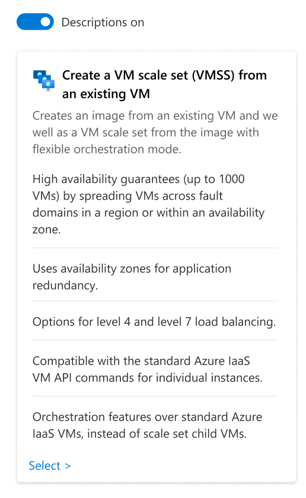
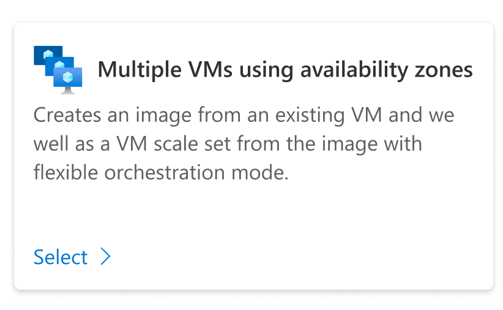
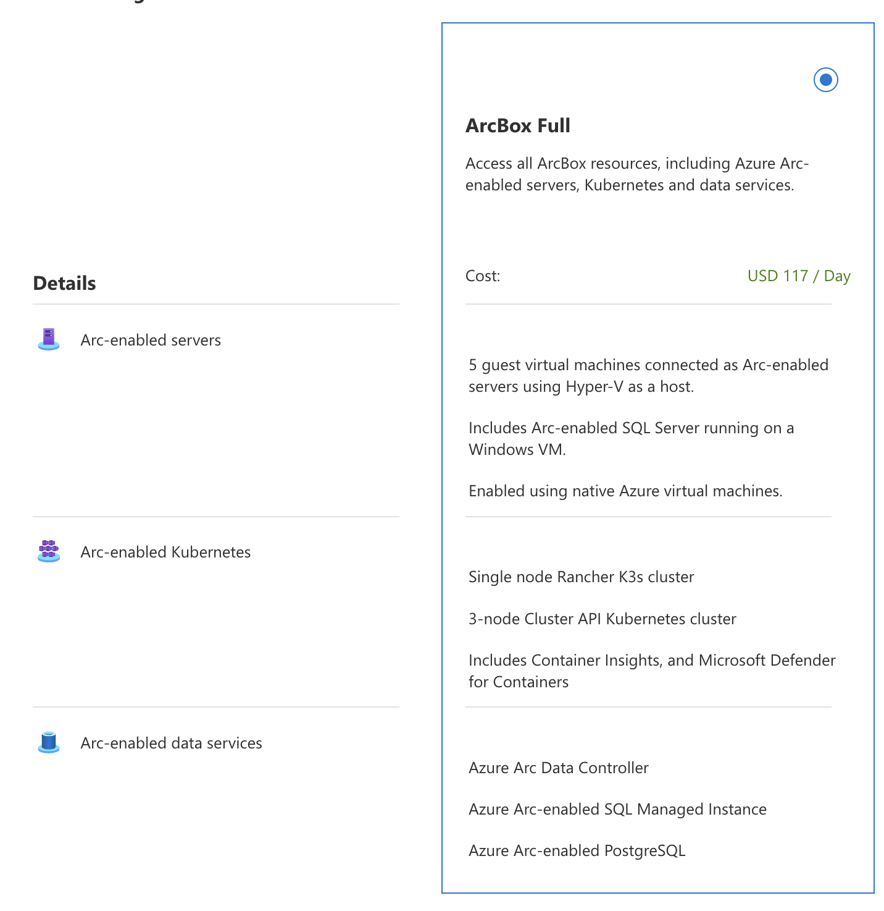
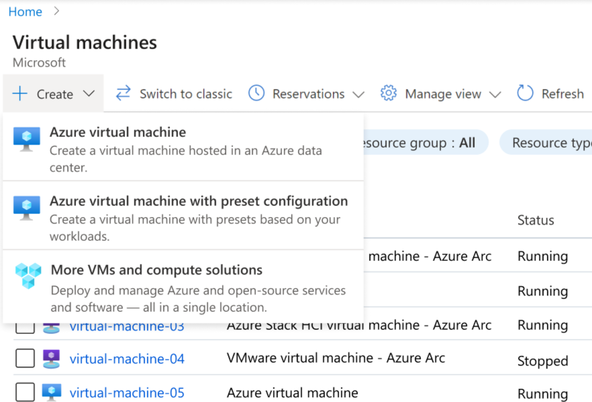

# Azure solutions metadata repository
      
## Overview

"Azure solutions" are an Azure portal tool which help customers find & create **_groups of_** Azure services and their associated software. Our "solutions" allow customers to compare full workloads in the Azure portal and enable Microsoft teams to showcase the business value of their products. 

Solutions:
- Help customers discover new products
- Share best practices for deploying cloud workloads
- Guide customers’ decision making – from a single content hierarchy, not multiple
- Consolidate multiple Azure services + software – representing full workloads for customers

We leverage similar discovery tools (e.g. [Architecture Center](https://github.com/mspnp/), [QuickStart Templates](https://github.com/Azure/azure-quickstart-templates), [Quickstart Center](https://ms.portal.azure.com/#view/Microsoft_Azure_Resources/QuickstartCenterBlade), [All services](https://ms.portal.azure.com/#allservices)) to define a new information hierarchy which can consolidate guidance to discover, decide, evaluate, and automate solutions.

This repository contains metadata defined in the Azure Portal's [All solutions](https://aka.ms/solutions/portal) experience.

## How to submit a solution?

Azure solutions enable partners to deploy and manage Azure and open-source services and software all with a single metadata-driven repository. Examples include deploying webapps and using inexpensive virtual machines for machine learning. 

To get started, 
1. Fork the repository.
2. Copy `starter-template-v1` and customize the name of the folder with your solution name (must be unique). 
3. Follow the instructions below to author your first solution and solution card.
4. Add an ARM template per configuration to your solution folder, and reference it using the `templateFileName`.
5. Replace **_starter-template-v1_** in this URL and test your experience at: https://portal.azure.com/?feature.canmodifystamps=true&Microsoft_Azure_SolutionCenter=flight2&feature.testmode=true#view/Microsoft_Azure_SolutionCenter/SolutionInfo.ReactView/solutionId/starter-template-v1

A solution includes:

### configuration.metadata

Configuration metadata is how your solution looks to others. It defines pricing, resources deployed, and the path for the ARM template. 

- overviewContent: a single paragraph defining the solution, when & why customers might consider your solution, and its use case.
- associatedResources: a list of resources which will be deployed as apart of the deployment.
   - If a portal asset type, enter:
      - resourceType: found in [portal asset types](https://ms.portal.azure.com/#view/Microsoft_Azure_Resources/AssetTypes.ReactView)
      - type: "AzureResource"
   - If not a portal asset type, upload the icon and specify a reference, i.e.:
      - displayName: custom display name
      - type: "Custom"
      - icon:
         - iconType: "CustomIcon"
         - iconFileName: enter the name of the file, typically uploaded to the `icons` directory
- pivots: the differences between the configurations, choose a unique name and display name for each pivot
- documentationFileName: a markdown file in the repository which helps with architecture diagrams and addditional resources for deployment (2nd tab of solution).
- configurations: the details for each configuration.
   - id: Vertical column unique ID.
   - title: Vertical column header 1.
   - templateFileName: The ARM JSON with parameters specified. This will auto-load a create flow once the user selects your configuration.
   - subTitle: Vertical column header 2.
   - cost
      - supports a cost score or currency value (hourly/daily/monthly)
   - maintenanceScore
   - pivotValues
      - pivotName
      - content

### discovery.metadata

Discovery metadata is how you define your solution in a solution grouping page.

- icon
- title
- shortDescription
- cost
- activationString
- keywords
- detailsDescription
- learnMoreLink
- learnMoreLinkText
- highlights: info on the card when expanded
   - content
   - highlightLearnMoreLink: optional
   - highlightLearnMoreLinkText: optional

#### **An example of a solution card with descriptions on**

#### **An example of a solution card with descriptions off**

#### **An example configuration with three pivots**
See `pivots` and `options` in `configuration.metadata` for implementation

## How to submit a solution group

So you have at least 3 solutions you'd like to help customers compare? Copy the `ExampleGroup.json` file under `scenariogroups` in the repository and add the solution IDs. Solution groups reference each individual `discovery.metadata.json` file to render the page.

## Where will solutions be visible?

You can direct link to a solution or solution group URI from any experience in the Azure portal.

Relevant solutions will also be accessible via VM browse / create dropdown, with 2MM monthly active users.

