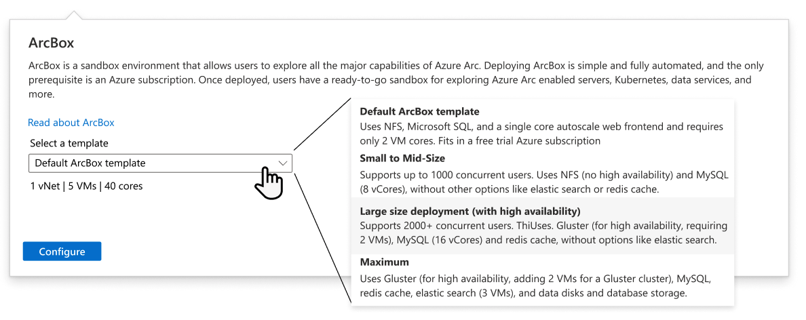

# Welcome to the Azure Compute Hub GitHub! :wave:
      
## Overview

This repository is the central repository for the metadata defined within the [Azure Compute Hub]() in the Azure Portal.

## How to submit a scenario

The Azure Compute Hub allows you to deploy and manage Azure and open-source services and software all in a single location. Some examples could be hosting websites or using inexpensive virtual machines for machine learning. Azure Compute Hub uses the concept of a "scenario" to help customers understand and configure services and software with ease.

A scenario includes:

### l1 (Level 1 hierarchy)
1. title - up to 50 characters, the name of the scenario customers - description of what is deployed.
2. short_description - up to 100 characters, a short description of what will be created.
3. cost_estimate - integer from 0 to 5, where 0 indicates the service is free, 1 indicates an average cost of less than $10 per subscription, and 5 indicates a cost of several thousands of dollars per month.
4. maintenance_estimate - integer from 1 to 5, where 1 indicates minimal maintenance needed, and 5 indicates significant team buildout required.
5. image - an SVG file path in this directory.

#### Example
```
"l1": {
    "title": "Scenario 1 - Create URL",
    "short_description": "Lorem ipsum dolor sit amet, consectetur adipiscing elit, sed do eiusmod tempor incididunt.",
    "cost_estimate": 2,
    "maintenance_estimate": null,
    "image": "./scenario.svg"
}
```
#### Implementation


### l2 (Level 2 hierarchy)
1. long_description - up to 1000 charaters, this describes when and why to deploy or configure the scenario.
2. config_options - an array of up to 8 elements, this specifies the configuraiton options which are common for the scenario.
    1. dropdown_label - up to 40 characters, the label for the dropdown.
    2. dropdown_description - up to 80 characters, the description for what will be deployed.
    3. resource_details - an array of up to 6 strings, this specifies a quick overview of what Azure services will be deployed.
    4. create - a link to a create URL that resolves in the Azure Portal or a blade name in portal.
    5. type - an enum "New" or "Existing", defining whether the scenario is intended to deploy or configure on new or existing Azure services. 

#### Example
```
"l2": {
    "long_description": "Lorem ipsum dolor sit amet, consectetur adipiscing elit, sed do eiusmod tempor incididunt ut labore et dolore magna aliqua. Ut enim ad minim veniam, quis nostrud exercitation ullamco laboris nisi ut aliquip ex ea commodo consequat. Duis aute irure dolor in reprehenderit in voluptate velit esse cillum dolore eu fugiat nulla pariatur. Excepteur sint occaecat cupidatat non proident, sunt in culpa qui officia deserunt mollit anim id est laborum.",
    "config_options": [
        {
            "dropdown_label": "Configuration 1",
            "dropdown_description": "Lorem ipsum dolor sit amet, consectetur",
            "resource_details": [
                "1 vNet", "5 VMs", "40 cores"
            ],
            "create":"https://portal.azure.com/#create/Microsoft.Template/uri/https%3A%2F%2Fraw.githubusercontent.com%2Fmicrosoft%2Fazure_arc%2Fmain%2Fazure_jumpstart_arcbox%2Fazuredeploy.json",
            "type": "New"
        },
        {
            "dropdown_label": "Configuration 2",
            "short_description": "Lorem ipsum dolor sit amet, consectetur",
            "dropdown_description": [
                "1 vNet", "5 VMs", "40 cores"
            ],
            "create":"VirtualMachineExtensionsBlade",
            "type": "Existing"
        }
    ]
}
```
#### Implementation



### l3 (level 3 hierarchy)
1. documentation - defines a link to a Markdown file which can be used to convey additional information, including information about the architecture, software and services deployed.

#### Example
```
"l3": {
    "documentation": "https://raw.githubusercontent.com/microsoft/azure_arc/main/README.md"
}
```

#### Implementation

